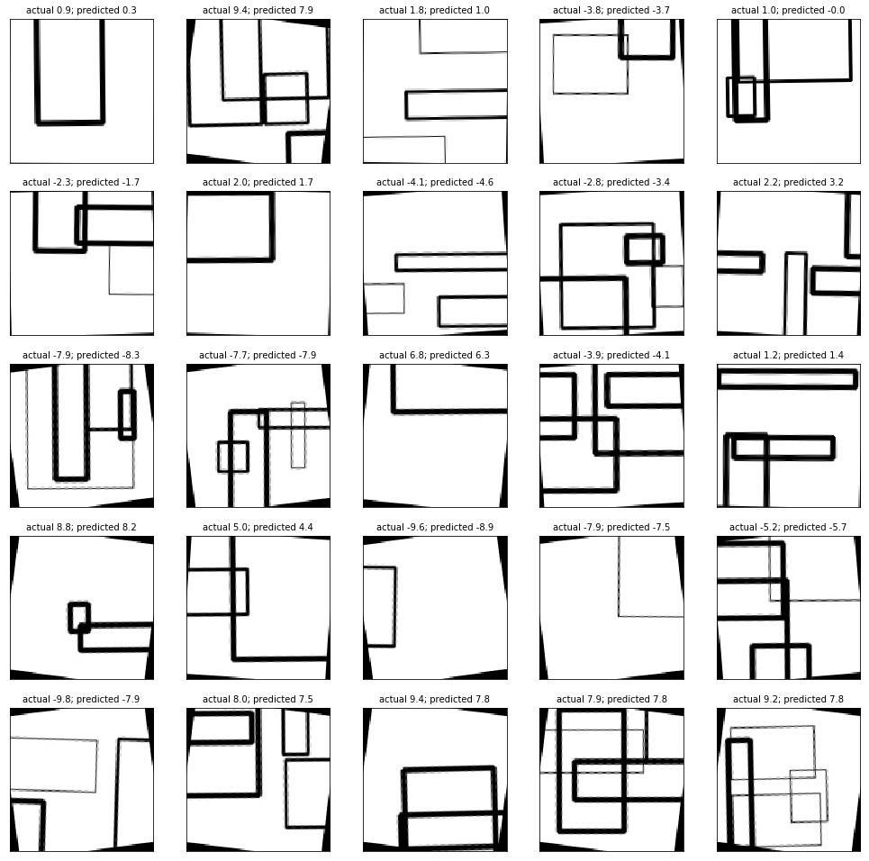

# Guess-Angle-CNN Project

## Overview

This is a test project where I train, validate and test a model using CNN. 

The model takes a plain white picture with draw rectangles that is randomly rotated between -10 and 10 degrees and predicts an angle of picture rotation.

**Goals of this Project:**

* Develop a pipeline for generating dataset of 11000 training pictures:
  * size of the picture 128x128
  * each picture contains one to five random rectangles
  * width/height of each rectangle is between 0.1 and 1 of width/height of the picture
  * width of the rectangle's borders is between 1 and 5 pixels
  * the center point of rectangle is randomly chosen from 128x128 area
  * after drawing rectangles the picture itself is randomly rotated between -10 and 10 degrees
* Write a network in TensorFlow that predicts picture's rotation angle
* Write a function that uses the output of the network to rotate given picture back
* Visualize the result

## Files:
* `dataset_generator.ipynb` - notebook used for generation of the dataset
* `dataset_helper.py` - python file with DataSet class that operates on generated data
* `model_keras_single_out.ipynb` - network architecture using Keras
* `model_single_out.h5` - Saved model
* `model_tf.ipynb` - network building, training and evaluating steps using TensorFlow

## Results
* Developed dataset generation pipeline that meets the requirements
* Built two models that predict an angle of rotation:
  * Simple model with one output in Keras that was trained for 30 epochs and achieved average error in prediction of 1.4 degrees (check [here](https://github.com/feklistoff/Guess-Angle-CNN-Project/blob/master/model_keras_single_out.ipynb))
  * Model in TensorFlow that was trained for 1500 epochs and achieved average error in prediction of 0.785 degrees on the test dataset of 1000 images (check [here](https://github.com/feklistoff/Guess-Angle-CNN-Project/blob/master/model_tf.ipynb))
* Visualised the results using function that takes as an input predicted angle and rotates the whole picture back

## Dependencies
Virtual environment can be created using `conda` from `environment.yml` file:

`conda env create -f environment.yml`

or you need Python 3.5 and the following libraries installed:

* [Jupyter](http://jupyter.org/)
* [NumPy](http://www.numpy.org/)
* [Pandas](http://pandas.pydata.org/)
* [scikit-learn](http://scikit-learn.org/)
* [OpenCV](http://opencv.org/)
* [TensorFlow](http://tensorflow.org)
* [Keras](https://keras.io/)
